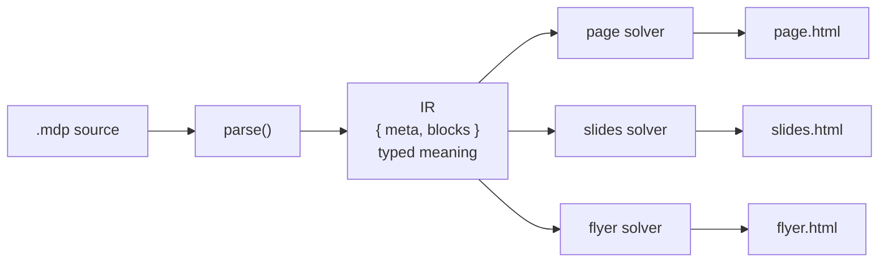

# MDP

**Markdown Presentation.** A presentation compiler for AI-written content. One
declarative `.mdp` source composes, deterministically, into many polished,
design-locked artifacts: a page, a slide deck, a flyer, a report, a one-pager, a
memo, a letter, and the interactive forms (scroll, accordion, tabs, stepper).

A markdown viewer gives you one rendering. MDP gives you a compiler.

[](https://barmoshe.github.io/mdp/)
[](LICENSE)
[](package.json)
[](https://github.com/barmoshe/mdp/actions/workflows/ci.yml)

[](https://www.npmjs.com/package/mdp-compiler)

> **Try it now, no install:** the [live playground and documentation](https://barmoshe.github.io/mdp/)
> run the real engine in your browser. Edit a source on the left, watch the page,
> slides, and flyer compile on the right.

## Why

AI writes oceans of Markdown. It is clean and cheap but reads as a flat wall of
text. Ask to "show it nicely" and you get a one-off HTML artifact that looks fine
once and is junky and unmaintainable the next day. MDP closes that gap. The
author, a person or an agent, writes meaning. The engine owns all design, so the
output cannot look junky. And the same source becomes a page, a deck, and a
flyer.

## How it works

The rendering method is deterministic composition over a semantic
representation, not templates and not live AI.



1. **A declarative source.** Markdoc-shaped: typed tags filled with data, no
   arbitrary code. Agent-emittable, statically checkable, safe.
2. **A semantic representation.** The source parses into typed meaning, the IR
   `{ meta, blocks }`. Intent, not layout.
3. **Deterministic composition.** Each artifact is a solver, not a template. It
   lays the meaning out against locked design tokens and reflows so it cannot
   look bad, compiled once and reproducible.
4. **AI authors, the engine composes.** The render path is pure: the same source
   produces byte-identical output every time.

## Quick start

### Install from npm

The engine ships as [`mdp-compiler`](https://www.npmjs.com/package/mdp-compiler),
zero dependencies, plain ESM, Node 18 or newer:

```bash
npm i mdp-compiler
```

```js
import { compile } from "mdp-compiler";

const html = compile(source, "slides"); // "page" | "slides" | "flyer" | "report" | "onepager" | "memo" | "letter" | "scroll" | "accordion" | "tabs" | "stepper"
```

### From source

Or clone and run the engine directly, no install:

```bash
git clone https://github.com/barmoshe/mdp
cd mdp
node packages/core/build.mjs examples/block-compare.mdp
```

This writes one HTML file per artifact into `dist/` (`page.html`, `slides.html`,
`flyer.html`, and, when a source opts into them, `report.html`, `onepager.html`,
`memo.html`, `letter.html`, `scroll.html`, `accordion.html`, `tabs.html`,
`stepper.html`). Open them in a browser. The render path is pure, so
two runs produce byte-identical output.

Try `examples/block-stats.mdp` for a simple brief, or `examples/block-compare.mdp`
for the full block set. To show or present an artifact, add `--open`:

```bash
node packages/core/build.mjs examples/block-compare.mdp --open slides
```

In the deck, arrows or space move, F toggles fullscreen, and print (Cmd or
Ctrl + P) exports a PDF. See the [CLI reference](https://barmoshe.github.io/mdp/#/docs/cli)
for `--out` and `--only`.

## Use it in your agent

MDP is not an app to visit and not a syntax to learn. It ships as a plugin, so
you go from content to a polished artifact without leaving your editor. Ask in
plain language; the agent authors clean MDP, compiles it, and opens the result.

**Claude Code** (this repo is the marketplace):

```text
/plugin marketplace add barmoshe/mdp
/plugin install mdp@mdp
```

Then "show this as a deck", "make a one-pager from this file", or `/mdp present <file>`.

**Codex** (a self-contained plugin in `codex/`):

```text
codex marketplace add barmoshe/mdp
```

Then enable MDP from the Codex app and ask "show this as a slide deck".

**Any MCP host** (Claude Desktop, Cursor, ...) via the `mdp-mcp` server:

```text
claude mcp add mdp -- npx -y mdp-mcp
```

It exposes `mdp_compile`, `mdp_present`, and `mdp_validate`. See the
[MCP server](https://barmoshe.github.io/mdp/#/docs/mcp) docs.

## What a source looks like

````text
---
mdp: 1
theme: studio
forms: [page, slides, flyer]
title: Two ways to run the digest
---

# Two ways to run the digest
{.lead} Both paths reach the same result. They differ in where the work runs.

```mdp:flow
Collect data -> The model writes the summary -> Send one message
```

```mdp:compare
# Managed platform
badge: no code
- See and edit the pipeline yourself.

# Self-hosted script
badge: in your stack
- Everything stays in your account.
```

:::callout recommendation
Start self-hosted, then move later if you prefer a visual builder.
:::
````

It is valid, readable Markdown. There is no styling in the source: no sizes, no
fonts, and the only color you may name is a brand color the engine derives and
gates. The design lives in the engine.

## Blocks

| Block | What it is |
|---|---|
| `{.lead}` / `{.cite}` | A standfirst under the title; an attribution under a quote. |
| `mdp:stats` | Key and value figures. |
| `mdp:compare` | Options side by side, each with a badge, note, pros, and a CTA. |
| `mdp:flow` | An `a -> b -> c` pipeline. |
| `:::callout` | A note, tip, cost, recommendation, or warning aside. |
| `---` | A section break: a divider on a page, a slide break in slides. |
| `lang` / `dir` | Set `dir: rtl` in the frontmatter and the whole layout flips. |
| `brand-logo` / `brand-accent` / `brand-font` | Add a logo, name a brand color (one hex) the engine re-lights into a full WCAG-AA accent set, or set the body font from a closed set of system stacks. |

Full grammar in the [documentation](https://barmoshe.github.io/mdp/#/docs/blocks)
and the [spec](SPEC.md).

## How one source maps to each form

| Block | page | slides | flyer |
|---|---|---|---|
| First `#` + `{.lead}` | masthead | title slide | header |
| `##` heading | section in flow | slide heading | surface section |
| `---` | divider | slide break | panel divider |
| `mdp:stats` | table | big figures | figure band |
| `mdp:compare` | card grid | own slide | full-width grid |
| `mdp:flow` | chip row | chip row | full-width chip row |
| blockquote + `{.cite}` | pull quote | full quote slide | quote block |

The document forms inherit these readings: `report`, `memo`, and `letter` read
each block exactly as `page` does, and the one-pager composes them like `flyer`.
The interactive forms (`scroll`, `accordion`, `tabs`, `stepper`) each reframe the
same block set into their respective navigation model.

## The design lock

`packages/core/src/tokens.mjs` is the single source of the look: two font
families, two weights, one warm neutral ink ramp plus a single restrained accent,
light and dark, no gradients or shadows. The author writes meaning only and
cannot reach the design, so the over-decorated "junky artifact" look is
impossible by construction. Pick a vibe with the `theme` field, a curated palette
from the spectrum (`studio`, `ocean`, `teal`, `forest`, `amber`, `terracotta`,
`coral`, `rose`, `plum`, `violet`, or `mono`); every theme passes WCAG AA in
light and dark, verified by `npm test`.

## Documentation

Full docs live on the site, rendered alongside the live playground:

- [Getting started](https://barmoshe.github.io/mdp/#/docs/getting-started)
- [The format](https://barmoshe.github.io/mdp/#/docs/format) and [blocks](https://barmoshe.github.io/mdp/#/docs/blocks)
- [Forms](https://barmoshe.github.io/mdp/#/docs/forms) and [themes](https://barmoshe.github.io/mdp/#/docs/themes)
- [CLI](https://barmoshe.github.io/mdp/#/docs/cli), [plugins](https://barmoshe.github.io/mdp/#/docs/plugins), and [architecture](https://barmoshe.github.io/mdp/#/docs/architecture)

In-repo: the [vision](VISION.md), the [spec](SPEC.md), and the machine-facing
build guide [AGENTS.md](AGENTS.md).

## The site and playground

The hub at [barmoshe.github.io/mdp](https://barmoshe.github.io/mdp/) lives in
`site/` (a Vite + React app) and bundles the real engine straight from
`packages/core`, so the playground compiles with the same code the CLI and the
plugins run. The engine itself stays dependency-free; only the docs site has a
build. It deploys to GitHub Pages on every push to `main`.

## Status

Early and honest. A working engine that proves the core claim: one source
composes deterministically into many clean artifacts, with a first set of blocks
and right-to-left support. The format and the block grammar will move before 1.0.
Issues and ideas are welcome.

## Roadmap

The live playground, the `mdp-mcp` MCP server, and the `create-mdp-extension`
scaffolder are shipped and published to npm. Next: an `mdp:chart` block and a
JSON Schema conformance test.

## Contributing

See [CONTRIBUTING.md](CONTRIBUTING.md) and [AGENTS.md](AGENTS.md), the
machine-facing build guide. The bar for a change: keep the engine pure (the
render path is deterministic and byte-identical across runs) and keep the design
locked.

## License

Apache-2.0. See [LICENSE](LICENSE) and [NOTICE](NOTICE).
